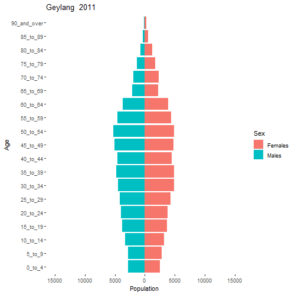
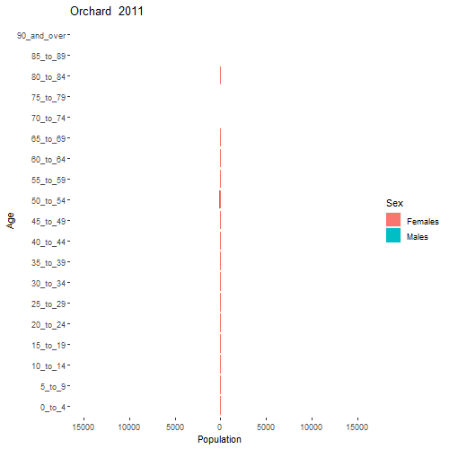

```{r setup, include=FALSE}
knitr::opts_chunk$set(echo = FALSE)
```


# Task
Apply appropriate interactivity and animation methods to design an age-sex pyramid based data visualisation to show the changes of demographic structure of Singapore by age cohort and gender between 2000-2020 at planning area level.

For this task, the data sets entitle Singapore Residents by Planning Area / Subzone, Age Group, Sex and Type of Dwelling, June 2000-2010 and Singapore Residents by Planning Area / Subzone, Age Group, Sex and Type of Dwelling, June 2011-2020 should be used. These data sets are available at Department of Statistics home page.

# 1.0 Challenges
1. The requirement is to show the age-sex pyramid for multiple planning areas over multiple periods. Hence, there is a need to organize the visualisations to clearly define the planning areas and periods. The visualisations should also allow easy comparison across multiple planning areas over the same period and hence a consistent scale has to be used across the charts for all planning areas.

2.    The original dataset provides the populations of males and females of various age bands living in different residential property types. Hence, there is a need to consolidate the populations of the same sex-age band, year and planning area from the various property types.

3.    For the age-sex pyramid visualisation, 2 bar plots are required, 1 for male and 1 for female. However, in the original dataset, the data for males and data for females are provided in a single table. Hence there is a need to filter the data for males and data for females and put them in separate plots for further handling.

4.   The AG column of the original dataset describes the age bands in a mix of numeric and non-numeric characters, for example “0_to_4”. If sorted based on the original description in AG, the sorting would be based on the alphanumeric characters instead of the numerical ages. Hence, the numerical values in the description has to be extracted and expressed numerically so that sorting of the age bands can be done correctly.

5. There are 55 planning areas. Hence, there is a need to organize the charts to avoid cluttering and yet provide a clear view of the age-sex pyramids of all 55 planning areas. Also, due to the number of charts required, rendering is time-consuming.

# 2.0 Sketch of Visualisation

Each visualisation would consist of horizontal bar charts showing data at each planning area. Male populations by age bands would be shown on the left side while female populations by age bands would be shown on the right side. The y-axis would show the age bands in ascending order. The x-axis would show the populations. The x-axis point between the male and female populations would be set at value 0, with positive numbers increasing from both sides of the point.

The chart would be animated, with each frame showing the data from each year, progressing in ascending order ie from 2011 to 2020.


# 3.0 Step-by-Step Data Visualisation Preparation

## 3.1 Install and load required libraries

```{r, echo=TRUE}
packages = c('ggiraph','plotly','DT','patchwork','gganimate','tidyverse','readxl','gifski','gapminder','sf','tmap','rgdal','ggplot2','scales','magick')
for (p in packages){
  if(!require(p, character.only = T)){
    install.packages(p)
    }
  library(p,character.only = T)
}
```


## 3.2 Read CSV file
```{r, echo=TRUE, warning=FALSE, message=FALSE}
population <- read.csv("data/respopagesextod2011to2020.csv")
```

## 3.3 Tidy data

### 3.3.1 Group population count by PA, AG, Sex and Time
```{r, echo=TRUE, warning=FALSE, message=FALSE}
population_summary <- population %>% group_by(Sex,PA,AG,Time) %>% summarise(Pop = sum(Pop))
```

### 3.3.2 Extract Starting Numeric Value of Age Group for Sorting
```{r, echo=TRUE}
population_summary$BandMinAge <- gsub('([0-9]+).*','\\1',population_summary$AG)
population_summary$BandMinAge <- as.numeric(population_summary$BandMinAge)
population_summary <- population_summary[order(population_summary$BandMinAge, decreasing = FALSE),]
population_summary$PlanningArea <- toupper(population_summary$PA)
```


### 3.3.3 Plot Age-Sex Pyramid for Whole of Singapore
```{r, echo=TRUE}
SGpyramid <- ggplot(population_summary, aes(x = reorder(AG,BandMinAge), y = Pop, fill = Sex)) + 
  geom_bar_interactive(data=subset(population_summary, Sex == "Females"), stat = "identity", aes(y=Pop)) + 
  geom_text_interactive(data = subset(population_summary, Sex == "Females"), aes(y = Pop,label=''), 
      size = 4, hjust = -0.1) +
  geom_bar_interactive(stat = "identity", data = subset(population_summary, Sex == "Males"), aes(y=Pop * (-1)) )+
  scale_y_continuous(name="Population", breaks=c(-150000,-100000,-50000,0,50000,100000,150000), labels = c("150,000","100,000","50,000","0","50,000","100,000","150,000") ) +
  coord_flip()+
  labs(title = "Singapore | Year: {frame_time}", x = "Age")+
  theme(panel.background = element_rect(fill = 'white'))+
  transition_time(Time)+
  ease_aes('linear')
SG<- image_read(animate(SGpyramid, width = 500, height=500))
SG
```


### 3.3.4 Plot Animated Age-Sex Pyramid for each PA
```{r, echo=TRUE, eval=FALSE}

countPA = 0
for (area in unique(population_summary$PA)){
  
  d <- subset(population_summary, PA == area)
  plot.new()
  PAplot<- (ggplot(d, aes(x = reorder(AG,BandMinAge), y = Pop, fill = Sex)) + 
    geom_bar_interactive(data=subset(d, Sex == "Females"), stat = "identity", aes(y=Pop)) + 
    geom_text_interactive(data = subset(d, Sex == "Females"), aes(y = Pop,label=''), 
                          size = 4, hjust = -0.1) +
    geom_bar_interactive(stat = "identity", data = subset(d, Sex == "Males"), aes(y=Pop * (-1)) )+
    scale_y_continuous(
    name="Population", 
    breaks=c(-15000,-10000,-5000,0,5000,10000,15000), 
    labels = abs(c(-15000,-10000,-5000,0,5000,10000,15000)), 
    limits=c(-15000,15000)) +
    coord_flip()+
    labs(title = paste(area, " {frame_time}"), x = "Age")+
    theme(panel.background = element_rect(fill = 'white'))+
    transition_time(Time)+
    ease_aes('linear'))
  GIF<- image_read(animate(PAplot, width = 500, height=500))
  countPA = countPA + 1
  assign(paste0("GIF",countPA),GIF)
}
```


 








# 4.0 Discussion


The user interface for the visualisation could have been improved to allow better selection of each planning area for example using an interactive map function with filters for each year. Using 2020 data as an example, the following could have been done:

### Extract 2020 data
```{r, echo = TRUE}
population_summary2020 <- population_summary %>% filter(Time==2020)
population_summary2020 <- population_summary2020 %>% group_by(PA) %>% summarise(Pop = sum(Pop))

population_summary2020 <-population_summary2020[order(population_summary2020$Pop, decreasing = TRUE),]
```

### Load shp file for Singapore map
SHP file from URA website

https://data.gov.sg/dataset/4d9e3b2f-3f4b-488e-bb3a-3638ca656247/download
```{r, echo = TRUE}
shp <- st_read('data/MP14_PLNG_AREA_WEB_PL.shp', stringsAsFactors = FALSE)
```

### Join 2020 population data with map by Planning Area name
```{r, echo = TRUE}
pop2020<-population_summary2020
pop2020$PlanningArea <- toupper(population_summary2020$PA)
map_pop <- inner_join(shp, pop2020, by = c("PLN_AREA_N"="PlanningArea"))
map_pop <- map_pop %>%
  mutate(
    tooltip_text = paste0(PA,"\n", Pop)
  )
```

### Plot map of Planning Areas by 2020 Population
```{r, echo = TRUE}
popmapplot<- ggplot(map_pop)+
  geom_sf_interactive(aes(fill=Pop, tooltip=tooltip_text, data_id=PA))+
  scale_fill_gradient(low = "white", high="red", na.value="grey", labels=comma)+
  labs(fill="2020 Population")+
  theme(axis.text=element_text(size=0))
girafe(ggobj=popmapplot, width_svg=10, height_svg=8)
```

Due to limitations in R, it is difficult to display an animated age-sex pyramid in the tooltip of the map planning area.


