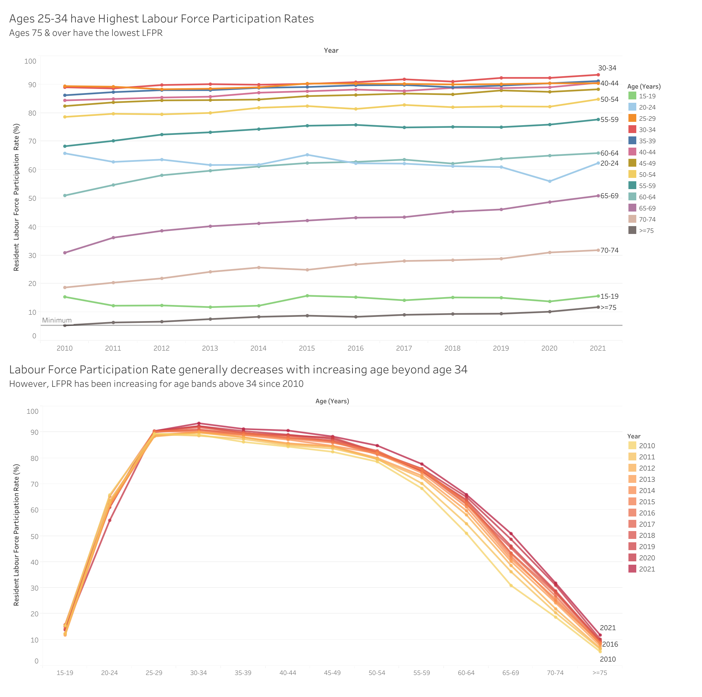
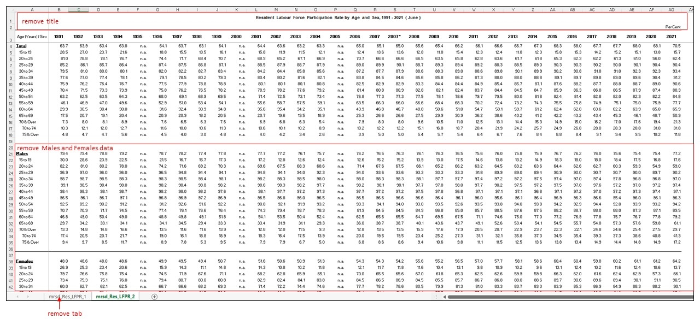
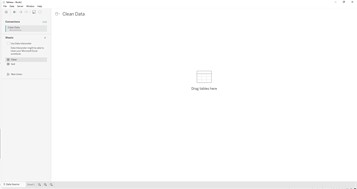
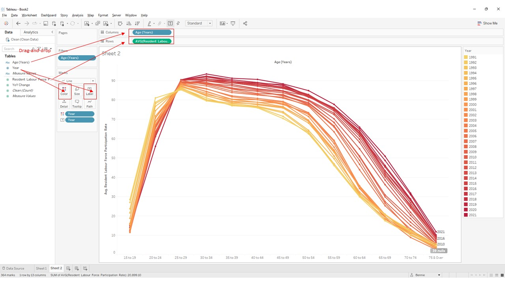
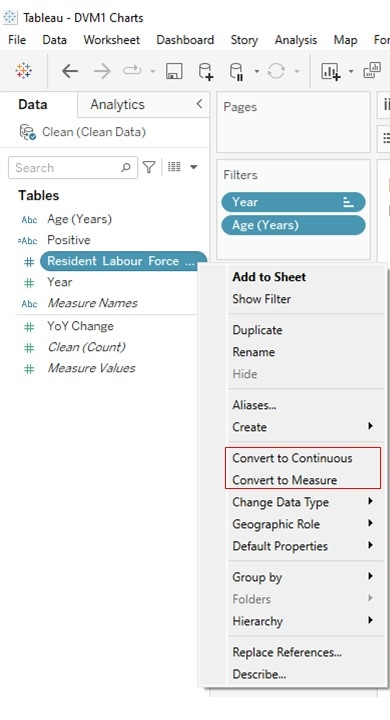
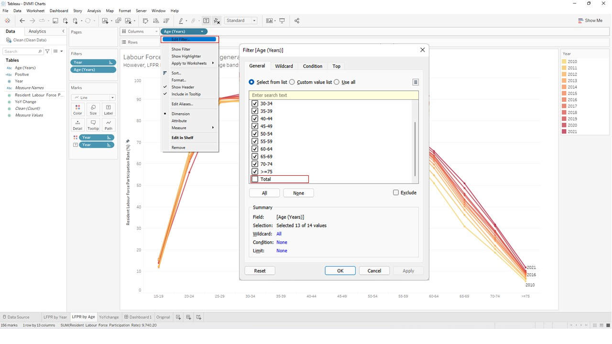
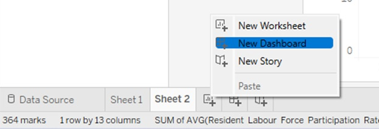
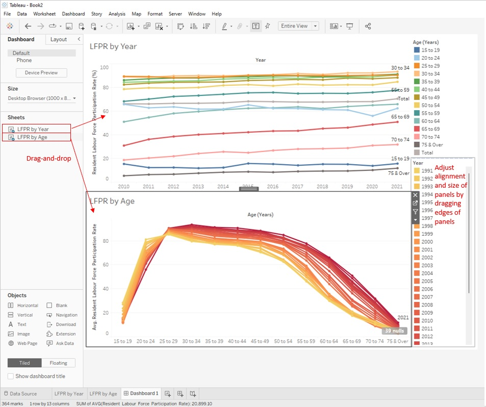
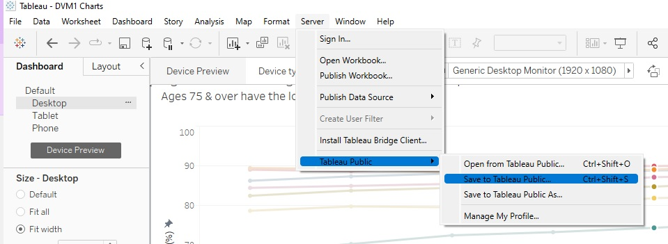

```{r setup, include=FALSE}
knitr::opts_chunk$set(echo = FALSE)
```


{width=100%} 

#  <font size="7">A1. Critique on graph </font>

## Clarity
1. **Y-axis label** should indicate what “Lpfr” stands for as it is not immediately obvious that is stands for “Labour force participation rate” (LFPR). The y-axis should also indicate “%” or “percent” as a unit of measurement.

2. **Top x-axis** Age-groups are not ordered in ascending Age but in ascending participation rate. This may provide a misleading impression that LFPR increases with age.

3. **Bottom x-axis label** shows only “2015”, giving the wrong impression that the data is for 2015 only when it is in fact plotting data for several years. After attempting to re-construct the visualisation from the data, it seems that the chart is trying to show data from 2010 to 2021.

4. **Title** should be more useful instead of repeating the y-axis label.

5. **Overlapping Age-group** -  The “70 & over” category consists of “70 to 74” and “74 & over” category and hence the “70 & over” category should not be displayed to avoid confusion.

6.  **Chart type** used is an area chart. The area chart might not be appropriate to display percentages as it gives an impression that the chart is representing volume. A line chart would be more appropriate to show percentages.


## Aesthetics
1. **Bottom x-axis label** for “Year” is unnecessarily repeated for each age-group, resulting in a cluttered view.

2. **Top x-axis labels** for Age-group are truncated for “70 & over” and “75 & over”. There is duplication of information in the top x-axis labels and legend. Either one of them could be removed to avoid duplication and to reduce clutter in the chart.

3. **Vertical gridlines** within each Age-band with no apparent meaning. When put alongside the different age-groups, the internal gridlines look unevenly spaced across the entire chart.

{width=100%} 

# <font size="7">A2. Alternative Data Graphical Presentation</font>

## Sketch 1: Line plot of LFPR against Year

To visualise the changes in LFPR of each age-group clearly, it is proposed to use a line chart with LFPR on the y-axis and Year on the x-axis. Each line would represent each age-group.

### Advantages
1. Based on the height of each line on the chart, it would be easy to visualise the age-groups with high and low LFPR. 

2. Users of the chart would also be able to visualise the movement of LFPR for each age group over the years in chronological order.

{width=100%}


## Sketch 2: Line plot of LFPR against Age

To facilitate visualisation of how LFPR varies with Age, a line chart of LFPR on the y-axis and Age-group on the x-axis could be used. Each line one the chart would represent the Year.

### Advantages
1. Using this chart, users would be able to identify peaks or troughs of LFPR across the Age-groups.

2. By comparing the heights of the lines, users can easily identify years in which there were general increases or decreases in LFPR.

{width=100%}

# <font size="7">A3. Proposed Data Visualisation</font>

## Dashboard
The overall visualisation dashboard would consist of 2 charts:

1. Line Chart of LFPR vs Year (2010-2021)

2. Line Chart of LFPR vs Age (2010-2021)

The dashboard is available on Tableau Public via this [link](https://public.tableau.com/app/profile/bennie5728/viz/DVM1Charts/Dashboard1?publish=yes).

{width=100%}


# <font size="7">A4. Step-by-step Description on Visualisation Preparation</font>

### Data Wrangling

The original data was in an Excel file “mrsd_29_Res_LFPR_28Jan2022.xlsx”. 

From the Excel file, tab “mrsd_Res_LFPR_1” was removed as it was not required.

In the remaining tab “mrsd_Res_LFPR_2”, the LFPR data was in table with the different Years as column headers and Age groups as rows. 

The table titles and footnotes in the Excel file were removed. Data on Male and Female LFPR was removed as they would not be used.

{width=100%}

For remaining data on overall LFPR, the Year columns were stacked to facilitate further visualisation in Tableau. The clean data was saved into an Excel file "Clean Data.xlsx".
{width=50%} 

### Load data to Tableau

1. Launch Tableau. Under “File” tab, click “Open”. Select data Excel "Clean Data.xlsx".
{width=100%}
2. Click and Drag tab with data to the right panel.
{width=100%}

### Plot Chart 1: LFPR against Year

3. Rename a new sheet as "LFPR by Year". In the Sheet, click on the triangle dropdown of the Resident LFPR field and click “Convert to Measure”. 

{width=100%} 
4. Drag the “Year” variable to the “Columns” field. Drag the LFPR variable to the “Rows” field. From the “Data” panel on the left, Drag the “Age (Years)” variable to the “Color” square in “Marks” card. From the “Data” panel on the left, Drag the “Age (Years)” variable to the “Label” square in “Marks” card.

 
5. On the dropdown triangle of the “Resident LFPR” variable, click on “Change Data Type” > “Number (decimal)”.

{width=100%} 
6. In the “Rows” field, click on the triangle dropdown of “CNTD(LFPR)” > “Measure” > “Average”
{width=100%} 
7. In the “Columns” field, click on the triangle dropdown of “Year” > “Discrete”.
{width=100%} 

In the “Columns” field, click on the triangle dropdown of “Year” > “Filter…”
{width=100%} 
Check only the required Years ie 2010 to 2021. Click “OK”.
{width=50%}

8. Right-click on y-axis, “Edit axis” to edit the Range and Axis title
{width=100%}
{width=50%}
9. On the dropdown triangle of “Age (Years)” variable, click on “Filter” and uncheck the “Total”. Click “OK”.

{width=100%}
10. Double-click on chart title to edit title.

{width=100%}

### Plot Chart 2: LFPR against Age

1. Rename a new sheet "LFPR by Age". In the new sheet, drag the “Age (Years)” variable to the “Columns” field. Drag the LFPR variable to the “Rows” field. 
From the “Data” panel on the left, Drag the “Age (Years)” variable to the “Color” panel in “Marks” card. Edit the colors of the lines using the “Color” panel.
From the “Data” panel on the left, Drag the “Age (Years)” variable to the “Label” panel in “Marks” card. Adjust the appearance of the labels using the “Label” panel.
{width=100%}

2. In the “Data” panel on the left, click on the triangle dropdown of the “Resident LFPR” variable and click “Convert to Measure” and “Convert to Continuous”. 
{width=50%}


3. In the “Columns” field, “Age (Years)” variable dropdown, click “Filter”, uncheck “Total” and click “OK”.
{width=100%}

### Create Dashboard

1. Right-click on the bottom bar and click "New Dashboard" to create a new dashboard.
{width=50%}

2. Drag and drop the sheets "LFPR by Year" and "LFPR by Age" from the Sheets panel to the dashboard space. Drag the edges of the panels in the dashboard to adjust and align the panels.

{width=100%}

3.  To publish the dashboard on Tableau Public, click on the "Server" tab, "Tableau Public", "Save to Tableau Public...".
{width=100%}

# <font size="7">A5. Major Observations</font>

## Observation 1
Age group 30-34 had the highest LFPR for most years except for 2010, 2011 and 2015. This suggests that this age band is one of the most employable, with a high LFPR of 88% to 93%.

Age group for 75 and over has the lowest LFPR among all age groups over the years, suggesting that this age group is the least economically productive.

## Observation 2
For age groups from 60 year onwards, the LFPR has been steadily increasing since 2010, suggesting that there is an increasing trend for people to continue to work longer. 

In 2012, the Retirement and Re-employment Act was enacted to employees to work beyond the retirement age of 62 up to age 65.^[1]^ In 2017, the reemployment age was further raised to 67.^[2]^
 

However, there is no marked change in trend for these age groups before and after the enactment of the various legislations, suggesting that the steady increase in LFPR is being driven by other factors especially for age groups 70 and above which are not affected by the legislation.


## Observation 3
For age group 20-24, the LFPR has been steadily decreasing since 2010 with a slight rebound in 2015 and 2021. The downward trend could be due to an increasing proportion of persons in the age band choosing to pursue further education before entering the labour force. In line with this reasoning, the gross enrollment ratio for tertiary education in Singapore, which increased from 71% in 2010 to 91% in 2019.^[3]^

# References
1. Ministry of Manpower (2010) *Tripartite Guidelines on the Re-employment of Older Employees*. Retrieved 13 February 2022 from:  https://www.mom.gov.sg/-/media/mom/documents/press-releases/2010/tripartite-guidelines-on-the-re-employment-of-older-employees.pdf

2. Ministry of Manpower (2017) *Retirement and Re-employment (Amendment) Bill 2016 Second Reading Speech at Parliament*. Retrieved 13 February 2022 from: https://www.mom.gov.sg/newsroom/speeches/2017/0109-retirement-and-re-employment-amendment-bill-2016-second-reading-speech-by-minister

3. Data.gov.sg (2021) *Combined And Gross Enrolment Ratio For Primary, Secondary & Tertiary Education*. Retrieved 13 February 2022 from: https://data.gov.sg/dataset/combined-and-gross-enrolment-ratio-for-primary-secondary-tertiary-education?view_id=6439cb96-c8f3-46c1-a0c6-7dae233a6783&resource_id=9dcdd20c-e24c-46a4-9044-cc2b2745a7fc  


