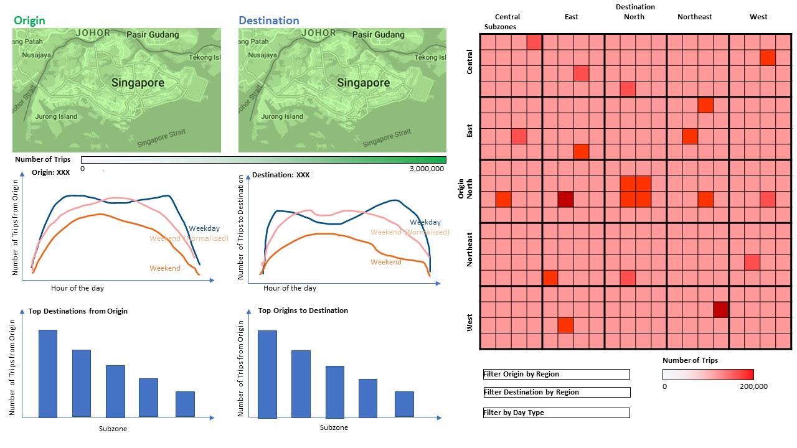
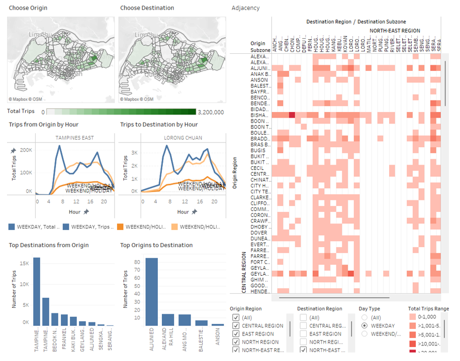
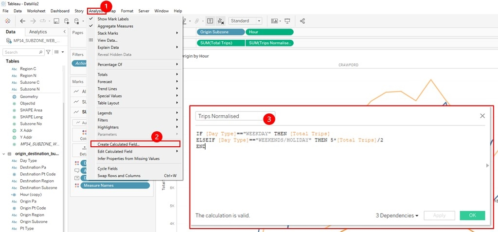
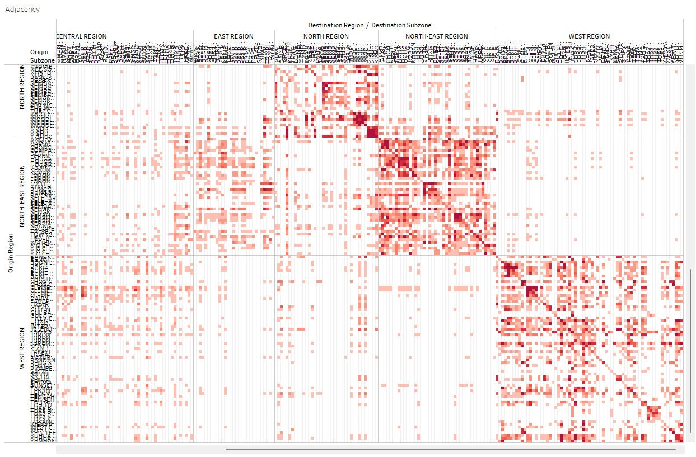

```{r setup, include=FALSE}
knitr::opts_chunk$set(echo = FALSE)
```

#  <font size="7">A1. Critique on graph </font>

## Clarity
1. **Y-axis limits of bar charts** for "Trips generated from" and "Trips generated from" vary based on the subzone data, making it difficult to making comparison across the 2 charts. The limits of the 2 bar charts should be consistent to allow convenient comparison of the bus volume.

2. **Filter selection of bar charts** have a "Null" option. It is not clear what that option represents.

3. **Subzone labels on adjacency matrices** are either missing or illegible, making it difficult for users to identify the origin and destination. Users need to hover over the matrix fill in order to identify the origin and destination.

4. **Values of adjacency matrices** is based on percentage instead of absolute number of trips. It is not clear what percentage is being represented because the tooltip shows "% of Total Total Trips along Table (Across)".

5. **Bar chart filter title and adjacency matrix axes** use abbreviation "Sz" to denote subzone. It may not be clear to users what "Sz" means.

## Aesthetics
1. **Separate bar charts** were used to display the number of weekday and weekend bus trips, making it difficult for users to make direct comparisons. The data for both weekday and weekend bus trips could be displayed in a single chart, for example as 2 separate line graphs or as clustered bar charts.

2. **Height-width ratio of adjacency matrices** are not proportionate. Ideally, if there are equal numbers of subzones represented on each axis, the lengths of the x and y axes should be the same.

3. **Colouring of adjacency matrix** does not bring out the differences in intensity of the number of bus trips of the various subzones. A wider colour gradient should be used to represent the number of bus trips.


## Interactivity
1. **Bar chart subzone selection** requires 2 separate drop-down selection lists for "Trips generated from" and "Trips generated from". If the user is interested in viewing the "to" and "from" data of one subzone, the user would need to make the selection twice.

2. **Tooltip of bar chart** does not provide additional information ie it shows the Day Type, Time per Hour and Total Trips, information which is already shown on the chart axes and labels.

3. **Click selection of bar chart** only serves to dim the other bars. The user selection is not linked to other charts.

# <font size="7">A2. Alternative Data Graphical Presentation</font>


{width=100%}

### Maps for Origin and Destination

The alternative graphic presentation would consist of 2 maps, 1 for origin and 1 for destination.
The maps would allow for interactive selection of subzone.
On clicking on a particular subzone of the map, the number of trips vs hour of the day of the selected subzone would be shown as a line graph below the map.

There would also be corresponding bar charts showing the top corresponding destinations/origins of the origin/destination subzones that were selected by the user on the map.

### Line chart for Number of trips vs Hour of the day 

There would be 3 different lines on the line chart for Weekdays, Weekends/Holidays and Weekends/Holidays Normalised. Weekends/Holidays Normalised represents the number of trips if there had been the same number of weekend/holiday days as the number of weekdays within the year.

Selection on any of the lines would filter the bar chart of number of trips of top destination/origins by the selected Day Type.

### Bar chart for Number of trips vs Subzone of top destination/origin

The bar chart would show the number of trips of the top destinations/origins that correspond to the origin/destination subzone selected on the map.

Clicking on a particular destination/origin bar will filter the corresponding destination/origin line chart for Number of trips vs Hour of the day.

### Adjacency matrix

Subzones on the adjaceny matrix would be grouped based on the Region followed by alphabetical order. The fill of the matrix would represent the number of trips. Filters can be applied to filter the origin and destination Regions, and the Day Type. 

Clicking on a cell of the adjacency matrix will filter the line charts and bar charts according to the origin subzone and destination subzone represented by the adjacency matrix cell.


# <font size="7">A3. Alternative Data Graphical Presentation</font>

The new graphical presentation can be access on Tableau Public: https://public.tableau.com/app/profile/bennie5728/viz/DataViz2_16477740577560/Dashboard 

{width=100%} 

# <font size="7">A4. Step-by-step Description on Visualisation Preparation</font>

Open file and add required files in Tableau.
{width=100%} 
{width=100%} 

Link the .csv file to the .shp file.
{width=100%} 

Add filters to exclude records where subzones are Null.
{width=100%} 

Create OriginMap sheet.
{width=100%} 

Create DestinationMap sheet.
{width=100%}


As total number of trips on weekends/holiday would generally be less than the total number of trips on weekdays due to fewer weekend/holidays within the year, there is a need to normalise the number of trips for weekends/holidays in order for a like-for-like comparison. Hence, a calculated field can be created for the normalised weekends/holiday number of trips.

Create calculated field "Trips Normalised".
{width=100%}


Create OriginTime sheet.
{width=100%} 

Create DestinationTime sheet.
{width=100%}

Create Destination sheet.
{width=100%}

Create Origin sheet.
{width=100%}

Create Adjacency sheet.
Create calculated field "1"
{width=100%}

Create calculated field "Total Trips Range"
{width=100%}

Drag required variables into fields.
{width=100%}

Create Dashboard.
{width=100%}

Add Dashboard Actions to filter graphs based on user click selection.
{width=100%}
{width=100%}

Edit "Day Type" filter to link it to OrignMap and DestinationMap.
{width=100%}

Final graphical representation annotated with filter linkages.
{width=100%}

# <font size="7">A5. Major Observations</font>

1. Tampines East subzone has the highest number of trips as an origin and as a destination. This is followed by Bedok North.

2. On weekdays, the peak periods are around 7am and 6pm. On weekends/holidays, the peak period is around 11am-12pm.

3. From the adjacency matrix, larger number of trips are intra-region ie the origin and destination are within the same region.
{width=100%}


