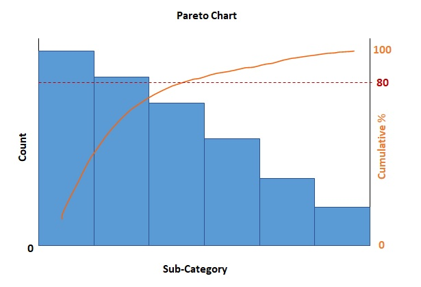
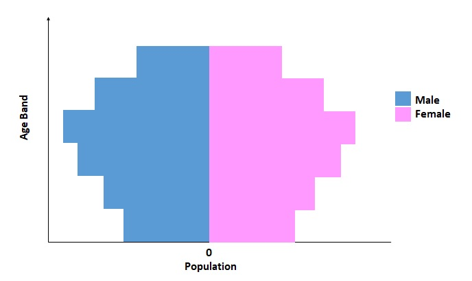

```{r setup, include=FALSE}
knitr::opts_chunk$set(echo = FALSE)
```


# Task 1: Pareto Chart for Returns by Sub-Category of Products
## 1.1 Challenges
1. There are 2 sheets provided in the Excel data, one containing the full list of orders with details including the order Sub-Category, and another sheet containing only the Order IDs of returned orders. Hence, there is a need to join the 2 sheets to obtain the full details of only the returned orders.

2. The cumulative percentage for the Pareto chart needs to be derived. This would involve:
(a)   grouping the counts of the returned orders by Sub-Category, 
(b)   ordering the Sub-Categories in descending order, and 
(c)   obtaining a cumulative count and percentage based on the order of Sub-Categories. 

3   For the visualisation, two chart types would be required ie bar chart for the count under each Sub-Category, and a line chart for the cumulative percentage. This would involve the use of a secondary y-axis and adjustment of the scales of each axis to ensure that the visualisation is clear.

## 1.2 Sketch of Proposed Visualisation

The proposed visualisation would consist of bar chart with count of returned orders on the y-axis by Sub-Category sorted in descending order on the primary x-axis. 

The secondary y-axis would be a line chart showing the cumulative percentage of the returned orders.

Additionally, there would be a horizontal reference line to show the 80% mark.

The package 'tidyverse' would be used to format the data while the package 'readxl' would be used to read the .xls file.




## 1.3 Step-by-Step Data Visualisation Preparation

### 1.3.1 Install and load required libraries
```{r, echo=TRUE}
packages = c('tidyverse','readxl')

for (p in packages){
  if(!require(p, character.only = T)){
    install.packages(p)
  }
  library(p, character.only = T)
}
```

### 1.3.2 Read Excel file
```{r, echo=TRUE, warning=FALSE, message=FALSE}
orders <- read_xls("data/Superstore-2021.xls",
                   sheet = "Orders")
returns <- read_xls("data/Superstore-2021.xls",
                    sheet = "Returns")
```

### 1.3.3 Join Returns and Order Sheets to obtain Detailed list of Returned Orders
```{r, echo=TRUE}
joined_tab <- left_join(returns, orders,
                        by = c("Order ID" = "Order ID"))
names(joined_tab)[names(joined_tab) == "Sub-Category"] <- "SubCat"
```

### 1.3.4 Count Returned Orders by Sub-Category and Sort Sub-Categories in Descending Order
```{r, echo=TRUE}
FC <- as.data.frame(table(joined_tab$`SubCat`))
names(FC)[names(FC) == "Var1"] <- "SubCat"
FC <- FC[order(FC$Freq, decreasing = TRUE),]
FC$SubCat <- factor(FC$SubCat, levels=FC$SubCat)
```

### 1.3.5 Compute Cumulative Frequency and express as Percentage
```{r, echo=TRUE}
FC$cumulative <- cumsum(FC$Freq)
FC$cpercent<- 100*FC$cumulative/sum(FC$Freq)
```


### 1.3.6 Plot Visualisation
```{r, echo=TRUE}
ggplot(FC, aes(x=SubCat, y-Freq))  + 
  geom_bar(stat="identity", aes(y=Freq), fill="navy") +
  geom_line(aes(group=1, y = cpercent*5.6),color="orange") +
  geom_point(aes(y = cpercent*5.6),color="orange") +
  geom_hline(yintercept = 80*5.6,linetype="dashed",color="brown")+
  geom_text(aes(x=0, y=80*5.6, label = "80%"),
            position=position_dodge(width=0),
            hjust=-26,vjust=-1, size=5, color="brown")+
  scale_y_continuous(breaks=seq(0,560,50), limits=c(0,plyr::round_any(max(FC$Freq),10,f=ceiling)), sec.axis = sec_axis(trans=~./5.6, name="Cumulative %"))+
  labs(y = "Count", x="")+
  theme(axis.text.x = element_text(angle = 50, vjust =1.2, hjust=1),
        axis.ticks = element_blank(),
        panel.background = element_blank())
```
# Task 2: Population Age-Sex Pyramid
## 2.1 Challenges
1. The original dataset provides the populations of males and females of various age bands living in different residential property types. Hence, there is a need to consolidate the populations of the same sex-age from the various property types.

2. For the age-sex pyramid visualisation, 2 bar plots are required, 1 for male and 1 for female. However, in the original dataset, the data for males and data for females are provided in a single table. Hence there is a need to extract the data for males and data for females and put them in separate datasets for further handling.

3. The AG column of the original dataset describes the age bands in a mix of numeric and non-numeric characters, for example "0_to_4". If sorted based on the original description in AG, the sorting would be based on the alphanumeric characters instead of the numerical ages. Hence, the numerical values in the description has to be extracted and expressed numerically so that sorting of the age bands can be done correctly.

## 2.2 Sketch of Visualisation

The visualisation would consist of horizontal bar charts. Male populations by age bands would be shown on the left side while female populations by age bands would be shown on the right side. 
The y-axis would show the age bands in ascending order. 
The x-axis would show the populations. The x-axis point between the male and female populations would be set at value 0, with positive numbers increasing from both sides of the point.




## 2.3 Step-by-Step Data Visualisation Preparation

### 2.3.1 Install and load required libraries
```{r, echo=TRUE}
packages = c('tidyverse')

for (p in packages){
  if(!require(p, character.only = T)){
    install.packages(p)
  }
  library(p, character.only = T)
}
```
### 2.3.2 Read CSV file
```{r, echo=TRUE, warning=FALSE, message=FALSE}
population <- read.csv("data/respopagesextod2021.csv")
```

### 2.3.3 Extract Males Data
```{r, echo=TRUE}
males <- population %>% filter(population$Sex=="Males")
males <- as.data.frame(males)
```

### 2.3.4 Group and Summarise Males Data by Age Group
```{r, echo=TRUE}
males <- males %>% group_by(AG) %>% summarise(cover = sum(Pop))
```

### 2.3.5 Extract Starting Numeric Value of Males Age Group for Sorting
```{r, echo=TRUE}
males$BandMinAge <- gsub('([0-9]+).*','\\1',males$AG)
males$BandMinAge <- as.numeric(males$BandMinAge)
males <- males[order(males$BandMinAge, decreasing = FALSE),]
males$Sex <- "Males"
```

### 2.3.6 Extract Females Data
```{r, echo=TRUE}
females <- population %>% filter(population$Sex=="Females")
females <- as.data.frame(females)
```

### 2.3.7 Group and Summarise Females Data by Age Group
```{r, echo=TRUE}
females <- females %>% group_by(AG) %>% summarize(cover = sum(Pop))
```

### 2.3.8 Extract Starting Numeric Value of Females Age Group for Sorting
```{r, echo=TRUE}
females$BandMinAge <- gsub('([0-9]+).*','\\1',females$AG)
females$BandMinAge <- as.numeric(females$BandMinAge)
females <- females[order(females$BandMinAge, decreasing = FALSE),]
females$Sex <- "Females"
```

### 2.3.9 Combine Males and Females Age Band Summaries into 1 Table
```{r, echo=TRUE}
MF <- rbind(males,females)
```

### 2.3.10 Plot Visualisation
```{r, echo=TRUE}
ggplot(MF, aes(x = reorder(AG,BandMinAge), y = cover, fill = Sex)) + 
  geom_bar(data=subset(MF, Sex == "Females"), stat = "identity", aes(y=cover)) + 
  geom_text(data = subset(MF, Sex == "Females"), aes(y = cover,label=''), 
      size = 4, hjust = -0.1) +
  geom_bar(stat = "identity", data = subset(MF, Sex == "Males"), aes(y=cover * (-1)) )+
  scale_y_continuous(name="Population", breaks=c(-150000,-100000,-50000,0,50000,100000,150000), labels = abs(c(-150000,-100000,-50000,0,50000,100000,150000))) +
  coord_flip()+
  labs(x = "Age")+
  theme(panel.background = element_rect(fill = 'white'))
 
```