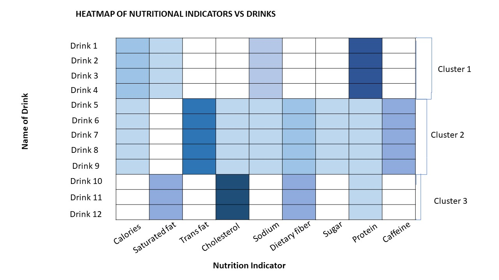

```{r setup, include=FALSE}
knitr::opts_chunk$set(echo = FALSE)
```

# Task 3
Create a data visualisation to segment kid drinks and other by nutrition indicators. For the purpose of this task, starbucks_drink.csv should be used.

# 1.0 Challenges

1. Data set consists of other categories of drinks which need to be filtered out.

2. Drinks have different portions and hence secondary measures need to be derived for the nutrition indicators to facilitate like-for-like comparison among the drinks of different portions.

3. Different drinks have the same name under the "Name" variable but differ in "Size", "Milk" and "Whipped Cream". Hence, there is a need to assign unique names to each record.

4. Variables may display collinearity and hence there is a need to identify and eliminate collinear variables before performing clustering.

5. The number of segments are unknown and hence there is a need to optimise the number of segments.


# 2.0 Sketch of Visualisation



# 3.0 Step-by-step Preparation

## 3.1 Install and load required libraries

```{r, echo=TRUE}
packages = c('seriation', 'dendextend', 'heatmaply', 'tidyverse', 'GGally', 'factoextra', 'NbClust')
for (p in packages){
  if(!require(p, character.only = T)){
    install.packages(p)
    }
  library(p,character.only = T)
}
```

## 3.2 Read CSV file
```{r, echo=TRUE, warning=FALSE, message=FALSE}
all_data <- read.csv("data/starbucks_drink.csv")
```

## 3.3 Tidy data

### 3.3.1 Extract records with Category "kids-drinks-and-other"
```{r, echo=TRUE, warning=FALSE, message=FALSE}
kids_drink <- filter(all_data, Category == "kids-drinks-and-other")
```

### 3.3.2 Create unique names for each record by combining "Name", "Size", "Milk" and "Whipped Cream" values
```{r, echo=TRUE, warning=FALSE, message=FALSE}
kids_drink$UniqueName <- paste(kids_drink$Name, kids_drink$Size ,kids_drink$Milk ,kids_drink$Whipped.Cream)
```

### 3.3.3 Derive secondary nutrition values based on per fluid ounce
```{r, echo=TRUE, warning=FALSE, message=FALSE}
kids_drink$Calories.poz <- kids_drink$Calories / kids_drink$Portion.fl.oz.
kids_drink$Calories.fat.poz <- kids_drink$Calories.from.fat / kids_drink$Portion.fl.oz.
kids_drink$Total.Fat.g.poz <- kids_drink$Total.Fat.g. / kids_drink$Portion.fl.oz.
kids_drink$Saturated.fat.g.poz <- kids_drink$Saturated.fat.g. / kids_drink$Portion.fl.oz.
kids_drink$Trans.fat.g.poz <- kids_drink$Trans.fat.g. / kids_drink$Portion.fl.oz.
kids_drink$Cholesterol.mg.poz <- kids_drink$Cholesterol.mg. / kids_drink$Portion.fl.oz.
kids_drink$Sodium.mg.poz <- kids_drink$Sodium.mg. / kids_drink$Portion.fl.oz.
kids_drink$Total.Carbohydrate.g.poz <- kids_drink$Total.Carbohydrate.g. / kids_drink$Portion.fl.oz.
kids_drink$Dietary.Fiber.g.poz <- kids_drink$Dietary.Fiber.g. / kids_drink$Portion.fl.oz.
kids_drink$Sugars.g.poz <- kids_drink$Sugars.g. / kids_drink$Portion.fl.oz.
kids_drink$Protein.g.poz <- kids_drink$Protein.g. / kids_drink$Portion.fl.oz.
kids_drink$Caffeine.mg. <- as.numeric(kids_drink$Caffeine.mg.)
kids_drink$Caffeine.mg.poz <- kids_drink$Caffeine.mg. / kids_drink$Portion.fl.oz.
```

### 3.3.4 Examine derived variables for multicollinearity
```{r, echo=TRUE, warning=FALSE, message=FALSE, fig.height=10, fig.width=10}
ggpairs(kids_drink[,20:31], upper = list(continuous = wrap("cor", size = 3)))
```
The following strong correlations were observed:

1. Calories per oz and Calories from fat per oz are highly correlated, hence Calories from fat per oz could be removed from the analysis.

2. Total Fat per oz and Saturated Fat per oz are are highly correlated. Since Total Fat per oz is a sum of the the constituent types of fat, Total Fat per oz can be removed from the analysis. A new variable for Non-saturated non-trans fat per oz can be created.

```{r, echo=TRUE, warning=FALSE, message=FALSE, fig.height=10, fig.width=10}
kids_drink$NonSatNonTrans.g.poz <- kids_drink$Total.Fat.g.poz - kids_drink$Saturated.fat.g.poz - kids_drink$Trans.fat.g.poz
```

3. Carbohydrates per oz and Sugar per oz are highly correlated. Since sugars and dietary fibre are a constituent of carbohydrates, Carbohydrates per oz can be removed from the analysis. A new variable for Non-sugar Non-fibre Carbohydrates per oz can be created.

```{r, echo=TRUE, warning=FALSE, message=FALSE, fig.height=10, fig.width=10}
kids_drink$NonSugarNonFibreCarb.g.poz <- kids_drink$Total.Carbohydrate.g.poz - kids_drink$Sugars.g.poz - kids_drink$Dietary.Fiber.g.poz
```

### 3.3.5 Re-examine the new set of variables for collinearity

```{r, echo=TRUE, warning=FALSE, message=FALSE, fig.height=10, fig.width=10}
ggpairs(kids_drink[,c(20,23:26,28:33)], upper = list(continuous = wrap("cor", size = 3)))
```

### 3.3.6 Assign unique names as row names

```{r, echo=TRUE, warning=FALSE, message=FALSE}
row.names(kids_drink) <- kids_drink$UniqueName
```

### 3.3.7 Extract required variables and convert to matrix

```{r, echo=TRUE, warning=FALSE, message=FALSE}
kids_drink_matrix <- dplyr::select(kids_drink, c(20,23:26,28:33))
kids_drink_matrix <- data.matrix(kids_drink_matrix)
```

## 3.4 Determine optimal number of clusters

Using the Elbow method, determine the optimal number of clusters.

```{r, echo=TRUE, warning=FALSE, message=FALSE}
# Elbow method
fviz_nbclust(kids_drink_matrix, kmeans, method = "wss") +
    geom_vline(xintercept = 4, linetype = 2)+
  labs(subtitle = "Elbow method")
```

The optimal number of clusters is 4.

## 3.5 Plot interactive heatmap
```{r, echo=TRUE, warning=FALSE, message=FALSE, fig.height=9, fig.width=30}
heatmaply(normalize(kids_drink_matrix),
          Colv=NA,
          seriate = "none",
          colors = Blues,
          k_row = 4,
          margins = c(NA,200,60,NA),
          fontsize_row = 4,
          fontsize_col = 7,
          main="Nutrition Indicators by Drink",
          xlab = "Nutrition Indicators Normalised",
          ylab = "Kids Drink & Others"
          )


```


# 4.0 Discussion

There were 4 clusters obtained:

1. Moderate to high dietary fiber and/or protein
2. High sodium, high sugar
3. High protein, moderate-high cholesterol
4. Either low or high protein, with moderate levels of other constituents

Manual observation is required to determine the defining characteristics of each cluster, and this may be subjective.

The heatmap height is constrained within 1 page length in order for users to easily observe the differences between each cluster on the heatmap. However, this results in the names of the drinks being cluttered on the left margin. Fortunately, the interactive tooltip allows users to identify each row of the heatmap.

