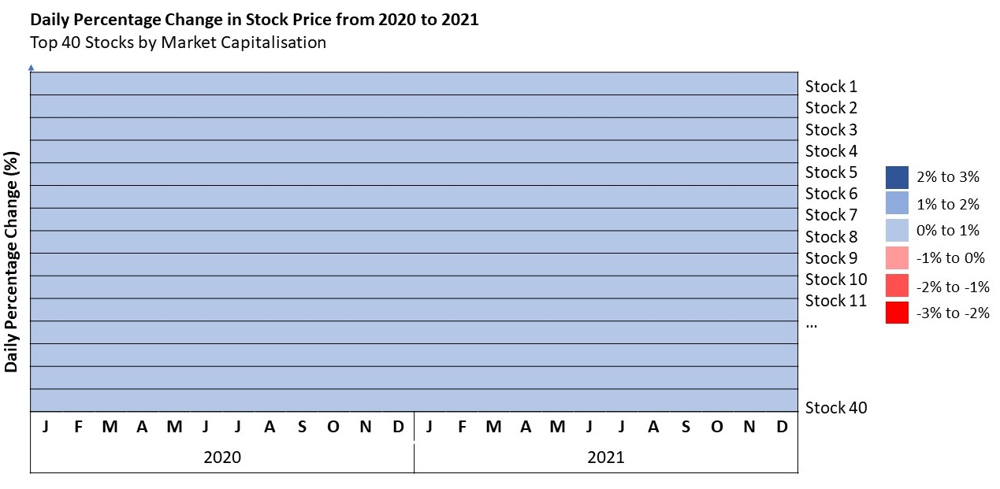

```{r setup, include=FALSE}
knitr::opts_chunk$set(echo = FALSE)
```

# The Task

Prepare a data horizon graph visualisation showing the historical stock prices between 1st January 2020 - 31st December 2021 by the top 40 companies by market capitalisation. 

# 1.0 Challenges

1. Data has to be scraped from Yahoo! Finance

2. Large number of companies to be represented in visualisation.

3. There are inherent differences in the stock prices of the various stocks and hence comparing absolute stock price fluctuations among the stocks may not be useful. Hence, a derived variable is required to compare the extent of change in the stock price eg percentage change in stock price.


# 2.0 Sketch of Visualisation



# 3.0 Step-by-step Preparation

## 3.1 Install and load required libraries

```{r, echo=TRUE}
packages = c('rvest','tidyverse','tidyquant','janitor','ggHoriPlot','ggthemes')
for (p in packages){
  if(!require(p, character.only = T)){
    install.packages(p)
    }
  library(p,character.only = T)
}
```

## 3.2 Scrape Data from Yahoo! Finance

Scrape stock prices from Yahoo! Finance. A for loop can be used to scrape each of the stocks.
The for loop will also

1. create an additional variable to record the stock symbol, 

2. create an additional derived variable "Change.percent" for the daily percentage change in stock price which is given by:

  $100 X (Closing Price - Opening Price) / Opening Price$
  
3. create an additional derived variable "Ranking" to rank the stocks from 1 to 40 in order of descending market capialisation. This variable will be converted to a string type to facilitate labeling of the visualisation.

```{r, echo=TRUE}
from_date = "2020-01-01"
to_date = "2021-12-31"
period_type = "days"  
top40stocks = c('SE','DBSDF','O39.SI','U11.SI','SNGNF','WLMIF','GRAB','SINGF','C38U.SI','SJX.F',
                'A17U.SI','BN4.SI','FLEX','SPXCF','G07.SI','G13.SI','2588.HK','C07.SI','M44U.SI','ME8U.SI',
                'C09.SI','O32.SI','N2IU.SI','U14.SI','BUOU.SI','S58.SI','T82U.SI','U96.SI','KLIC','K71U.SI',
                'KEN','RW0U.SI','CJLU.SI','U06.SI','C52.SI','HCTPF','TDCX','Z25.SI','KARO','TRIT')

df <- data.frame(matrix(vector(), 0, 9, dimnames=list(c(), c("date","open","high","low","close","Volume","Adjusted","Symbol","Ranking"))), stringsAsFactors=F)

ranking <- 0

for (stock in top40stocks){
  scraped = tq_get(stock,
                   get = "stock.prices",
                   from = from_date,
                   to = to_date) %>%tq_transmute(select     = NULL, 
                                                 mutate_fun = to.period,
                                                 period  = period_type)
  scraped$Symbol <- print(stock)
  scraped$Change.percent <- 100*(scraped$close - scraped$open)/scraped$open
  
  ranking <- ranking + 1
  scraped$Ranking <- ranking
  
  df <- rbind(df,scraped)
  
}

```
## 3.3 Determine Cut Points and Origin

Origin for the Change.percent variable would be set to 0 to facilitate differentiation of increases and decreases.

```{r, echo=TRUE}
ori <- 0
```

To determine the cut points of the horizon graph, the maximum and minimum values of the horizon graph would be set as follows:

$Minimum = Q1 - 1.5 X IQR$ rounded down to nearest integer

$Maximum = Q3 + 1.5 X IQR$ rounded up to nearest integer

```{r, echo=TRUE}
min_display <-  floor(quantile(df$Change.percent, 0.25, na.rm=T)-
        1.5*IQR(df$Change.percent, na.rm=T))

max_display <-  ceiling(quantile(df$Change.percent, 0.75, na.rm=T)+
        1.5*IQR(df$Change.percent, na.rm=T))

cat("Minimum value to display: ", min_display,'\n')
cat("Maximum value to display: ", max_display)
```

Hence, the cut points for the horizon graph would be set at intervals between -3 and 3.

```{r, echo=TRUE}
sca <- c(-30,-3,-2,-1,1,2,3,30)
```

## 3.4 Create function to return Symbol based on Ranking

Since the facet_grid method would arrange the horizon graph facets based on Ranking (eg 1, 2, 3 and so on) and display the Ranking as labels, there is a need to replace the Ranking labels with the corresponding stock Symbol.

A named vector is required to reference the Ranking to the Symbol.

```{r, echo=TRUE}
returnSymbol <- c(
"1"="SE",
"2"='DBSDF',
'3'='O39.SI',
'4'='U11.SI',
'5'='SNGNF',
'6'='WLMIF',
'7'='GRAB',
'8'='SINGF',
'9'='C38U.SI',
'10'='SJX.F',
'11'='A17U.SI',
'12'='BN4.SI',
'13'='FLEX',
'14'='SPXCF',
'15'='G07.SI',
'16'='G13.SI',
'17'='2588.HK',
'18'='C07.SI',
'19'='M44U.SI',
'20'='ME8U.SI',
'21'='C09.SI',
'22'='O32.SI',
'23'='N2IU.SI',
'24'='U14.SI',
'25'='BUOU.SI',
'26'='S58.SI',
'27'='T82U.SI',
'28'='U96.SI',
'29'='KLIC',
'30'='K71U.SI',
'31'='KEN',
'32'='RW0U.SI',
'33'='CJLU.SI',
'34'='U06.SI',
'35'='C52.SI',
'36'='HCTPF',
'37'='TDCX',
'38'='Z25.SI',
'39'='KARO',
'40'='TRIT')
```

## 3.5 Plot Visualisation

Plot the horizon graph.

```{r, echo=TRUE, fig.width=10, fig.height=8}

df %>% ggplot() +
  geom_horizon(aes(date, 
                   Change.percent,
                   fill = ..Cutpoints..), 
               origin = ori, horizonscale = sca) +
  scale_fill_hcl(palette = 'RdBu', reverse = T) +
  facet_grid(Ranking~.,labeller=labeller(Ranking=returnSymbol)) +
  theme_few() +
  theme(
    panel.spacing.y=unit(0, "lines"),
    strip.text.y = element_text(size = 7, angle = 0, hjust = 0),
    axis.text.y = element_blank(),
    axis.title.y = element_blank(),
    axis.ticks.y = element_blank(),
    panel.border = element_blank(),
    axis.text.x = element_text(angle = 90, size =7)
    ) +
  scale_x_date(expand=c(0,0), 
               date_breaks = "1 month", 
               date_labels = "%b %Y") +
  xlab('Date') +
  ggtitle('Daily Percentage Change in Stock Prices from 2020 to 2021', 
          'Top 40 stocks by Market Capitalisation ')

```


# 4.0 Observations

There was a general increase in stock prices in the period of March 2020 across the top 40 stocks. This was followed by a decrease in June 2020. 

There was a short rally in stock prices in May 2021 and December 2021.

Stock symbols SE, DBSDF, GRAB, SINGF, FLEX, 2588.K, KLIC, TDCV, KARO and TRIT had large percentage fluctuations in the stock prices.

# 5.0 Discussion

While the horizon plot could present large numbers of categories (eg stocks), it does not cluster categories based on those exhibiting similar patterns.

It may not be useful to plot daily changes in stock prices. Changes could be measured on a weekly or monthly basis.


